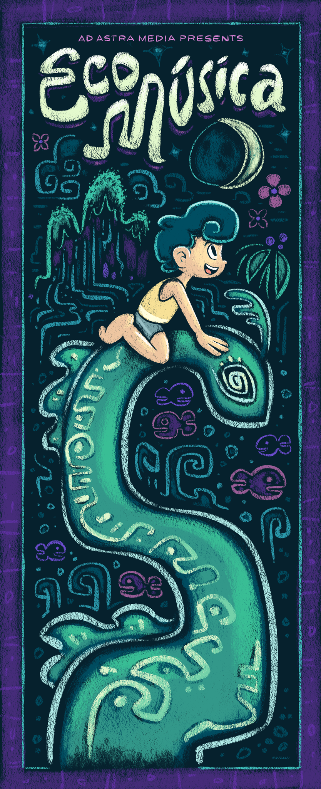

# 🎵 Eco-Musica AR Poster

**An Augmented Reality (AR) project built with [8th Wall](https://www.8thwall.com/) that brings an Eco-Musica poster to life!**

---

## 🌟 Project Overview

This project transforms a static **Eco-Musica** poster into an immersive AR experience.  
By scanning the poster with a mobile device, users can unlock animated 3D assets, background music, and interactive visual effects — all powered by 8th Wall’s WebAR technology (no app download required!).

---

## 📸 Features

- ✨ **Poster Tracking:** Detects the Eco-Musica poster in real-world space.
- 🎶 **Background Music:** Plays looping magical music upon scene activation.
- 🐟 **Animated Assets:** Includes animated fish, leaves, moon, and other dynamic elements.
- 🌙 **Custom Interactions:** Tap-to-play video, smooth fade-in/out effects, and subtle environmental motion.

---

## 🚀 Tech Stack

- **8th Wall WebAR**
- **A-Frame** (WebVR Framework)
- **JavaScript** (Custom A-Frame components)
- **HTML / CSS**

---

## 🖼️ Poster Example

> 

---

## Acknowledgements

- Built Using [8th Wall](https://www.8thwall.com/)
- Eco-Musica project inspiration.
